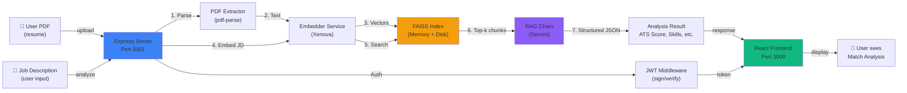
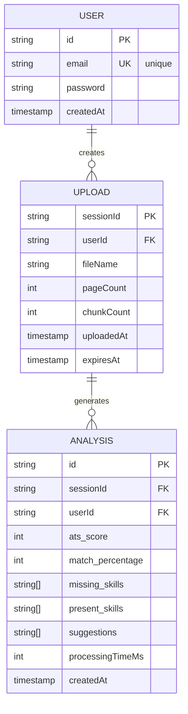

# Resume Analyzer - Technical Documentation

**Version:** 1.0.0  
**Last Updated:** May 3, 2026  
**Status:** Production-Ready (with ongoing hardening)

---

## Table of Contents

1. [Project Overview & Goals](#1-project-overview--goals)
2. [System Architecture](#2-system-architecture)
3. [Folder Structure & Module Explanation](#3-folder-structure--module-explanation)
4. [API Reference](#4-api-reference)
5. [Authentication & Authorization Flow](#5-authentication--authorization-flow)
6. [Data Model & Storage](#6-data-model--storage)
7. [Deployment & Operations](#7-deployment--operations)
8. [Known Limitations & Gotchas](#8-known-limitations--gotchas)

---

## 1. Project Overview & Goals

### Purpose

**Resume Analyzer** is an AI-powered Retrieval-Augmented Generation (RAG) system that evaluates resumes against job descriptions. It uses:

- **PDF Parsing** to extract text from resume documents
- **Vector Embeddings** (Xenova/all-MiniLM-L6-v2) to represent resume content semantically
- **FAISS** (Facebook AI Similarity Search) for efficient vector indexing and retrieval
- **Google Gemini API** for structured LLM-based analysis via a curated prompt

### Core Features

| Feature | Implementation | Trade-off |
|---------|-----------------|-----------|
| **Resume Upload** | Multipart form-data, max 5MB | Keeps request light; no chunked uploads |
| **Local Embeddings** | Xenova (on-device) | Slower than API embeddings but free & privacy-respecting |
| **Vector Search** | FAISS in-memory + disk persistence | Fast retrieval (~100ms); limited to in-process scaling |
| **Structured Analysis** | Gemini JSON mode | Reliable parsing; depends on external API |
| **Session Tracking** | UUID per upload → FAISS index | Stateless resume requests; index cleanup required |
| **JWT Auth** | 7-day expiration, localStorage | Simple but not refresh-token-based |

### Design Decisions

1. **Local Embeddings over API embeddings**
   - **Why**: Cost-free, privacy-respecting, no rate limits
   - **Trade-off**: Cold start on first use (~15–30s to download model); CPU-bound inference
   - **Future**: Could cache model in container or use GPU acceleration

2. **FAISS over traditional database**
   - **Why**: Sub-millisecond similarity search; no schema migration overhead
   - **Trade-off**: Ephemeral (lost on container restart); limited horizontal scaling
   - **Workaround**: Persist FAISS indices to disk; implement index cleanup via cron

3. **Gemini API over local LLMs**
   - **Why**: Higher quality structured output; no local GPU required
   - **Trade-off**: Rate-limited (15 req/min on free tier); external dependency; latency (1–3s)
   - **Future**: Could implement OpenAI/LM Studio fallback

4. **Single-page file upload (no batch)**
   - **Why**: Simpler UX; matches typical interview workflow (one resume per job)
   - **Trade-off**: Users cannot compare multiple resumes at once
   - **Future**: Batch API endpoint for bulk comparison

---

## 2. System Architecture

### High-Level Data Flow



### Component Responsibilities

#### Frontend (React/Vite)
- **Auth**: Sign up, login, logout via JWT tokens stored in `localStorage`
- **Upload**: Drag-drop PDF → multipart form submission
- **Analysis**: Input job description → poll backend for results
- **Results Display**: Render ATS score, match %, skills gap, suggestions
- **History**: Local storage of past analyses (optional)

#### Backend (Express.js)
- **Auth Middleware**: Validate JWT tokens from Authorization header
- **PDF Handler**: Accept multipart upload → extract text via `pdf-parse`
- **Embedder**: Generate vectors for text chunks using Xenova
- **Vector Store (FAISS)**: Create + save indices; perform similarity search
- **RAG Chain**: Orchestrate prompt building → Gemini API call → JSON parsing
- **Cleanup**: Hourly cron job to delete expired FAISS indices

#### External Dependencies
- **Gemini API**: Structured JSON analysis (15 req/min free tier)
- **Xenova Transformers**: On-device embeddings (CPU-bound)
- **FAISS**: In-memory vector search

### Request/Response Flow - Resume Upload

```
Client                                Server
  |                                      |
  |--POST /api/upload (multipart)------->|
  |   { file: resume.pdf }               |
  |                                      |
  |                        [Parse PDF -----> text]
  |                        [Chunk text ----> chunks[]]
  |                        [Embed chunks --> vectors[]]
  |                        [FAISS save -----> index.faiss + docstore.json]
  |                                      |
  |<------201 { sessionId, pageCount }---|
  |     { chunkCount, metadata }         |
  |                                      |
```

### Request/Response Flow - Analysis

```
Client                                      Server
  |                                            |
  |--POST /api/analyze (JSON)----------------->|
  |   { sessionId, jobDescription }            |
  |                                            |
  |                              [Load FAISS index for sessionId]
  |                              [Embed job description]
  |                              [Similarity search → top-k chunks]
  |                              [Build prompt + context]
  |                              [Call Gemini API -----> structured JSON]
  |                              [Parse + validate result]
  |                                            |
  |<----------200 { ats_score, match_% }------|
  |       { missing_skills, suggestions }     |
  |                                            |
```

---

## 3. Folder Structure & Module Explanation

### Directory Layout

```
resume-analyzer/
├── client/                          # React/Vite frontend
│   ├── src/
│   │   ├── App.jsx                 # Main component (multi-state manager)
│   │   ├── main.jsx                # React entry point
│   │   ├── index.css               # Tailwind CSS
│   │   ├── components/
│   │   │   ├── DropZone.jsx        # PDF upload drag-drop zone
│   │   │   ├── AnalyzingState.jsx  # Progress indicator during analysis
│   │   │   ├── ResultsPanel.jsx    # Display ATS score, skills, suggestions
│   │   │   ├── EmptyState.jsx      # Idle state (no upload yet)
│   │   │   └── ScoreRing.jsx       # Circular progress ring for ATS %
│   │   ├── hooks/
│   │   │   └── useAnalyzer.js      # Multi-step state machine (upload/analyze/done/error)
│   │   ├── context/
│   │   │   └── AuthContext.jsx     # Global auth state + JWT management
│   │   └── utils/
│   │       └── api.js              # Axios instance + interceptors (token injection)
│   ├── vite.config.js              # Vite build config (port 3000)
│   ├── tailwind.config.js          # Tailwind CSS customization
│   ├── postcss.config.js           # PostCSS (Tailwind processing)
│   └── package.json
│
├── server/                          # Express backend
│   ├── index.js                    # App entry point (middleware stack + route binding)
│   ├── routes/
│   │   ├── auth.js                 # POST /register, /login, GET /me
│   │   └── analyze.js              # POST /upload, POST /analyze
│   ├── middleware/
│   │   ├── auth.js                 # JWT verification middleware
│   │   ├── errorHandler.js         # Global error handler (4-arg signature)
│   │   ├── upload.js               # Multer config (PDF validation + size limit)
│   │   └── sanitize.js             # Input validation for /analyze requests
│   ├── services/
│   │   ├── pdfExtractor.js         # Extract text from PDF file path
│   │   ├── embedder.js             # Chunk text + generate embeddings (Xenova)
│   │   ├── vectorStore.js          # FAISS: save/load/search indices
│   │   ├── ragChain.js             # Orchestrate RAG pipeline + Gemini call
│   │   ├── ai.service.js           # Gemini API wrapper (JSON mode)
│   │   └── user.service.js         # User CRUD (bcrypt + JSON file storage)
│   ├── middleware/
│   │   └── logger.js               # Structured logging
│   ├── utils/
│   │   ├── logger.js               # Winston/custom logger
│   │   ├── cleanup.js              # Cron job to delete expired indices
│   │   └── validateEnv.js          # Ensure required env vars at startup
│   ├── data/
│   │   └── users.json              # JSON file storage (in-memory on load)
│   ├── faiss_indexes/              # Dynamic directory for FAISS indices
│   │   └── {sessionId}/
│   │       ├── faiss.index         # FAISS binary index
│   │       └── docstore.json       # Metadata + chunk content
│   ├── uploads/                    # Temporary PDF staging (deleted after extraction)
│   ├── .env                        # Runtime config (secrets, model, limits)
│   ├── render.yaml                 # Render deployment config
│   └── package.json
│
├── render.yaml                      # Service definition for Render backend
├── TECHNICAL_DOCUMENTATION.md       # This file
└── README.md                        # User-facing quickstart
```

### Key Module Explanations

#### Frontend: `src/context/AuthContext.jsx`
**Purpose**: Global auth state management via React Context API

**State**:
- `user` – Logged-in user object `{ id, email }`
- `token` – JWT token (persisted in localStorage)
- `loading` – Auth check in progress
- `register(email, password)` – Create account
- `login(email, password)` – Authenticate
- `logout()` – Clear token + local state

**Key Logic**:
```javascript
// On token change → inject into axios default header
useEffect(() => {
  if (token) {
    axios.defaults.headers.common['Authorization'] = `Bearer ${token}`
    localStorage.setItem('token', token)
  }
}, [token])

// On mount → check if token is still valid
useEffect(() => {
  if (token) {
    axios.get(`${apiBase}/me`).then(...).catch(...)
  }
}, [token])
```

**Gotcha**: Token is not automatically refreshed. If it expires, user must log in again.

---

#### Frontend: `src/hooks/useAnalyzer.js`
**Purpose**: Multi-step state machine for upload → analyze → results flow

**State Machine States**:
```
READY
  ↓ (handleFile)
UPLOADING → [POST /upload] → ANALYZING
  ↓ (handleAnalyze)
ANALYZING → [POST /analyze] → DONE
  ↓ (handleReset)
READY
```

**Error Handling**:
- `ERROR` state triggered on network failure or API error
- `isRetrying` flag for exponential backoff (built-in retry logic)
- Error banner shows user-friendly message

**Gotcha**: State resets on page reload (not persisted to localStorage by default).

---

#### Backend: `server/services/pdfExtractor.js`
**Purpose**: Extract text from PDF file using `pdf-parse` library

**Breaking Change (v2.4.5)**:
```javascript
// WRONG (v2.3.x default export)
import pdfParse from 'pdf-parse'
await pdfParse(buffer)

// CORRECT (v2.4.x named export)
import { PDFParse } from 'pdf-parse'
await new PDFParse(buffer)
```

**Process**:
1. Read file from disk (Multer staging path)
2. Parse via PDFParse → extract `.text` and `.numpages`
3. Delete file immediately (PII safety)
4. Return `{ text, pageCount, metadata }`

**Security**: File is deleted after extraction—no resume stored on disk.

---

#### Backend: `server/services/embedder.js`
**Purpose**: Convert text into vector representations using Xenova

**Key Functions**:
- `chunkText(text, sessionId)` – Split text into 250-char overlapping chunks → embed each
- Returns `Document[]` with `pageContent` + `metadata` (sessionId, chunkIndex)

**Performance Characteristics**:
- First call: ~15–30s (model download from HuggingFace)
- Subsequent calls: ~100–500ms (cached model, CPU-dependent)
- Output: Each chunk → 384-dim vector (from all-MiniLM-L6-v2)

**Gotcha**: Synchronous embedding is CPU-blocking. On high load, consider offloading to worker threads.

---

#### Backend: `server/services/vectorStore.js`
**Purpose**: FAISS index lifecycle (save, load, search, delete)

**Workflow**:
```
1. saveIndex(chunks, sessionId)
   → Create FAISS index from chunk vectors
   → Save to: faiss_indexes/{sessionId}/faiss.index
   → Save metadata to: faiss_indexes/{sessionId}/docstore.json
   → Return { chunkCount, indexPath }

2. loadIndex(sessionId)
   → Read faiss.index + docstore.json from disk
   → Return FAISS instance + chunks in memory

3. similaritySearch(sessionId, queryVector, topK)
   → Load index if not in cache
   → Search for top-k nearest neighbors
   → Return chunks ranked by cosine similarity

4. deleteIndex(sessionId)
   → Remove faiss_indexes/{sessionId}/ directory
   → Called by cleanup cron job on expiry
```

**Storage Model**:
- **Index File** (`faiss.index`): Binary FAISS format (~50–500KB per resume)
- **Docstore** (`docstore.json`): JSON metadata with chunk text + positions
- **Retention**: Configurable via `INDEX_TTL_HOURS` env var (default 24h)

**Scaling Limitation**: FAISS is in-memory + single-process. Cannot scale horizontally without external vector DB (Pinecone, Weaviate, Milvus).

---

#### Backend: `server/services/ragChain.js`
**Purpose**: Orchestrate the RAG (Retrieval-Augmented Generation) pipeline

**Pipeline**:
```
1. Load FAISS index for sessionId
2. Embed job description → vector
3. Search FAISS → top-5 resume chunks
4. Build context block from chunks
5. Construct structured prompt:
   - System role: "You are an ATS analyzer"
   - Schema: { ats_score, match_percentage, missing_skills, present_skills, suggestions }
   - Rules: "Return only valid JSON, no markdown"
   - Resume context: [chunks formatted]
   - Job description: [full text]
6. Call Gemini API with response_format: json_object
7. Parse JSON response
8. Validate all required fields present
9. Return typed result
```

**Result Structure**:
```javascript
{
  ats_score: number (0–100),
  match_percentage: number (0–100),
  missing_skills: string[] (max 10),
  present_skills: string[] (max 10),
  suggestions: string[] (max 5),
  meta: { sessionId, processingTimeMs, model: 'gemini-2.5-flash' }
}
```

**Error Handling**:
- Gemini API timeout (30s) → throws error
- Rate limit (429) → propagates to client
- Invalid JSON response → retries with more explicit prompt
- Missing fields → throws validation error

---

#### Backend: `server/middleware/auth.js`
**Purpose**: JWT token generation and verification

**Token Structure**:
```javascript
jwt.sign(
  { userId },
  process.env.JWT_SECRET,
  { expiresIn: '7d' }
)
```

**Middleware**:
```javascript
authMiddleware(req, res, next) {
  1. Extract token from "Authorization: Bearer {token}"
  2. Verify signature + expiration
  3. Attach userId to req.userId
  4. Call next()
}
```

**Gotcha**: Token expiration is 7 days (no refresh token). Client must re-login if expired.

---

#### Backend: `server/middleware/errorHandler.js`
**Purpose**: Centralized error handling with context-aware HTTP status codes

**Responsibility**:
- Catches all thrown errors from routes/middleware
- Maps business logic errors → HTTP status codes
- Returns JSON error response with detail field
- Logs error with request context

**Error Categories**:

| Error | HTTP Code | Example |
|-------|-----------|---------|
| File too large | 413 | Multer LIMIT_FILE_SIZE |
| Unsupported file type | 415 | Non-PDF upload |
| PDF extraction failed | 422 | Corrupted PDF |
| FAISS index not found | 404 | Invalid sessionId |
| Rate limit exceeded | 429 | Gemini quota exhausted |
| Invalid JWT | 401 | Expired/malformed token |
| Server error | 500 | Gemini API down |

**Must have 4 args** for Express to recognize as error middleware:
```javascript
const errorHandler = (err, req, res, next) => { ... }
```

---

## 4. API Reference

### Authentication Endpoints

#### POST /api/auth/register
Register a new user account.

**Request**:
```json
{
  "email": "user@example.com",
  "password": "securePassword123"
}
```

**Response (201)**:
```json
{
  "user": { "id": "1777805104195", "email": "user@example.com" },
  "token": "eyJhbGciOiJIUzI1NiIsInR5cCI6IkpXVCJ9...",
  "message": "User registered successfully"
}
```

**Response (400)**:
```json
{
  "error": "User already exists"
}
```

**Error Codes**:
| Code | Meaning |
|------|---------|
| 400 | Email already registered, or password < 6 chars |
| 500 | Server error (bcrypt failure, file I/O) |

**Validation Rules**:
- Email: Required, must be valid email format (basic check)
- Password: Required, minimum 6 characters

**Security**: Password is hashed with bcryptjs (salt rounds = 10) before storage.

---

#### POST /api/auth/login
Authenticate with email and password.

**Request**:
```json
{
  "email": "user@example.com",
  "password": "securePassword123"
}
```

**Response (200)**:
```json
{
  "user": { "id": "1777805104195", "email": "user@example.com" },
  "token": "eyJhbGciOiJIUzI1NiIsInR5cCI6IkpXVCJ9...",
  "message": "Logged in successfully"
}
```

**Response (401)**:
```json
{
  "error": "Invalid credentials"
}
```

**Error Codes**:
| Code | Meaning |
|------|---------|
| 401 | Email not found, or password mismatch |
| 500 | Server error |

---

#### GET /api/auth/me
Retrieve current user profile (requires valid JWT).

**Headers**:
```
Authorization: Bearer {token}
```

**Response (200)**:
```json
{
  "user": { "id": "1777805104195", "email": "user@example.com" }
}
```

**Response (401)**:
```json
{
  "error": "No token provided"
}
```

Or:
```json
{
  "error": "Invalid or expired token"
}
```

**Error Codes**:
| Code | Meaning |
|------|---------|
| 401 | Missing Authorization header, or token invalid/expired |
| 404 | User not found (shouldn't happen if token is valid) |

---

### Resume Analysis Endpoints

#### POST /api/upload
Upload a resume PDF and create a searchable FAISS index.

**Headers**:
```
Authorization: Bearer {token}
Content-Type: multipart/form-data
```

**Request**:
- Form field `file`: PDF file (max 5MB)

**Response (200)**:
```json
{
  "sessionId": "a1b2c3d4-e5f6-7890-abcd-ef1234567890",
  "pageCount": 2,
  "chunkCount": 8,
  "metadata": { ... },
  "message": "Resume uploaded and indexed successfully"
}
```

**Response (400)**:
```json
{
  "error": "No file uploaded"
}
```

**Response (413)**:
```json
{
  "error": "File too large",
  "detail": "Maximum allowed size is 5MB"
}
```

**Response (415)**:
```json
{
  "error": "Unsupported file type",
  "detail": "Please upload a PDF file"
}
```

**Error Codes**:
| Code | Meaning |
|------|---------|
| 400 | No file in request |
| 401 | Missing/invalid JWT |
| 413 | File > 5MB |
| 415 | Not a PDF |
| 422 | PDF text extraction failed (corrupted, scanned image, etc.) |
| 500 | Embedding generation failed |

**Rate Limiting**:
- Default: 10 uploads per 15 minutes per user
- Configurable via `RATE_LIMIT_MAX_UPLOAD` env var

**Gotcha**: Session expires after 24 hours (configurable `INDEX_TTL_HOURS`). Store sessionId in frontend for future analysis.

---

#### POST /api/analyze
Analyze resume against a job description using RAG + Gemini.

**Headers**:
```
Authorization: Bearer {token}
Content-Type: application/json
```

**Request**:
```json
{
  "sessionId": "a1b2c3d4-e5f6-7890-abcd-ef1234567890",
  "jobDescription": "We are hiring a Senior React Developer with 5+ years experience. Required: React, TypeScript, testing frameworks. Nice to have: Next.js, GraphQL, DevOps."
}
```

**Response (200)**:
```json
{
  "ats_score": 78,
  "match_percentage": 76,
  "missing_skills": [
    "GraphQL",
    "AWS DevOps",
    "Kubernetes"
  ],
  "present_skills": [
    "React",
    "TypeScript",
    "Jest",
    "Next.js"
  ],
  "suggestions": [
    "Add quantified impact metrics (e.g., 'Improved performance by 40%')",
    "Highlight leadership experience for senior role",
    "Include specific project outcomes on a company website"
  ],
  "meta": {
    "sessionId": "a1b2c3d4-e5f6-7890-abcd-ef1234567890",
    "processingTimeMs": 3247,
    "model": "gemini-2.5-flash"
  }
}
```

**Response (400)**:
```json
{
  "error": "sessionId is required"
}
```

Or:
```json
{
  "error": "jobDescription is required and must be at least 20 characters"
}
```

**Response (404)**:
```json
{
  "error": "Resume session not found",
  "detail": "No FAISS index exists for this sessionId. Re-upload the resume."
}
```

**Response (429)**:
```json
{
  "error": "Gemini quota exceeded",
  "detail": "The free tier allows 15 requests per minute."
}
```

**Response (500)**:
```json
{
  "error": "Analysis failed",
  "message": "Failed to parse Gemini response as valid JSON"
}
```

**Error Codes**:
| Code | Meaning |
|------|---------|
| 400 | Missing/invalid input fields |
| 401 | Missing/invalid JWT |
| 404 | Session/FAISS index not found |
| 429 | Rate limit (Gemini API) |
| 500 | Gemini API down, or JSON parsing failed |

**Rate Limiting**:
- Default: 20 analyses per 15 minutes per user
- Configurable via `RATE_LIMIT_MAX_ANALYZE` env var

**Performance Characteristics**:
- Average response time: 2–4 seconds (includes Gemini latency)
- Max response time: 30 seconds (timeout threshold)

**Gotcha**: If sessionId is expired (> 24h), FAISS index is deleted and call returns 404. User must re-upload.

---

#### POST /api/resume/export (Future)
Export analysis result as PDF.

**Headers**:
```
Authorization: Bearer {token}
Content-Type: application/json
```

**Request**:
```json
{
  "sessionId": "a1b2c3d4-e5f6-7890-abcd-ef1234567890",
  "format": "pdf" // or "json"
}
```

**Response (200)**:
- Content-Type: application/pdf
- Body: PDF binary stream

**Status**: Currently stubbed; full implementation pending.

---

## 5. Authentication & Authorization Flow

### Token Lifecycle

```
┌─────────────────────────────────────────────────────────────┐
│ 1. USER REGISTRATION                                         │
├─────────────────────────────────────────────────────────────┤
│                                                               │
│ Client (frontend)                Server                       │
│    POST /register                                             │
│    { email, password } --------→  Validate input             │
│                                    Hash password (bcrypt)     │
│                                    Store in data/users.json   │
│                                    Generate JWT (7d exp)      │
│    ← { token, user }              ←----------                 │
│                                                               │
│ Frontend: Save token to localStorage['token']                │
│                                                               │
└─────────────────────────────────────────────────────────────┘

┌─────────────────────────────────────────────────────────────┐
│ 2. USER LOGIN                                                │
├─────────────────────────────────────────────────────────────┤
│                                                               │
│ Client                            Server                      │
│    POST /login                                                │
│    { email, password } --------→  Find user in data/users.json
│                                    Verify password (bcrypt)   │
│                                    Generate JWT (7d exp)      │
│    ← { token, user }              ←----------                 │
│                                                               │
│ Frontend: Save token to localStorage['token']                │
│           Set axios default header:                          │
│           Authorization: Bearer {token}                      │
│                                                               │
└─────────────────────────────────────────────────────────────┘

┌─────────────────────────────────────────────────────────────┐
│ 3. PROTECTED REQUEST (upload/analyze)                        │
├─────────────────────────────────────────────────────────────┤
│                                                               │
│ Client                            Server                      │
│    POST /upload                                               │
│    Header: Authorization: Bearer {token}   →                 │
│                                  Extract token from header    │
│                                  Verify JWT signature         │
│                                  Check expiration (<7d)       │
│                                  Attach req.userId            │
│                                  Proceed to route logic       │
│    ← 200 { sessionId, ... }       ←----------                 │
│                                                               │
└─────────────────────────────────────────────────────────────┘

┌─────────────────────────────────────────────────────────────┐
│ 4. TOKEN EXPIRED / LOGOUT                                    │
├─────────────────────────────────────────────────────────────┤
│                                                               │
│ Scenario A: Token expired (> 7 days old)                     │
│ ──────────────────────────────────────────                   │
│ Client                            Server                      │
│    POST /upload (old token)       →                          │
│                                  Verify fails (exp check)     │
│    ← 401 { error: "..." }         ←----------                 │
│                                                               │
│ Frontend: Redirect to /login      localStorage['token'] = null│
│                                                               │
│ Scenario B: User clicks logout                               │
│ ────────────────────────────────                             │
│ Frontend: localStorage.removeItem('token')                   │
│           axios.defaults.headers.Authorization = undefined   │
│           Redirect to /login                                 │
│                                                               │
│ (No server-side logout endpoint needed for stateless JWT)     │
│                                                               │
└─────────────────────────────────────────────────────────────┘
```

### JWT Token Structure

**Payload** (decoded):
```json
{
  "userId": "1777805104195",
  "iat": 1777805104,
  "exp": 1778410904
}
```

**Headers**:
```json
{
  "alg": "HS256",
  "typ": "JWT"
}
```

**Signature**: HMAC-SHA256(`<header>.<payload>`, process.env.JWT_SECRET)

### Authorization Model

**Permission Matrix**:

| Endpoint | Auth Required | Scope |
|----------|---------------|-------|
| POST /auth/register | No | Public (anyone can sign up) |
| POST /auth/login | No | Public |
| GET /auth/me | Yes | User-scoped (own profile only) |
| POST /upload | Yes | User-scoped (own uploads only) |
| POST /analyze | Yes | User-scoped (own uploads only) |

**User Isolation**:
- FAISS indices stored per sessionId (UUID); no user namespace
- **Gotcha**: Session IDs are UUIDs, so technically discoverable if exposed
- **Future**: Hash sessionId with userId to prevent cross-user session access

### CORS & Cross-Origin Requests

**Current Configuration** (May 2026):
```javascript
app.use((req, res, next) => {
  const origin = req.get('origin') || '*'
  res.header('Access-Control-Allow-Origin', origin)
  res.header('Access-Control-Allow-Methods', 'GET, POST, DELETE, OPTIONS')
  res.header('Access-Control-Allow-Headers', 'Content-Type, Authorization')
  res.header('Access-Control-Allow-Credentials', 'true')
  if (req.method === 'OPTIONS') res.sendStatus(200)
  else next()
})
```

**Why permissive CORS**:
- Development: localhost:3000 needs access to localhost:5001
- Production: Vercel frontend needs access to Render backend

**Future hardening**:
```javascript
const allowedOrigins = [
  'https://resume-analyzer-beta-rose.vercel.app',
  'http://localhost:3000'
]
app.use(cors({
  origin: (origin, cb) => cb(null, allowedOrigins.includes(origin)),
  credentials: true
}))
```

---

## 6. Data Model & Storage

### User Data Model

**Schema** (JSON file storage):
```json
[
  {
    "id": "1777805104195",
    "email": "user@example.com",
    "password": "$2a$10$...", // bcryptjs hash
    "createdAt": "2026-05-03T11:00:00Z"
  }
]
```

**Storage Location**: `server/data/users.json`

**Constraints**:
- Email must be unique (enforced in-memory on load)
- Password minimum 6 characters
- No soft deletes (deletion is permanent)

**Scaling Limitation**: JSON file storage is not suitable for production scale. Migrate to:
- PostgreSQL (recommended)
- MongoDB
- Firebase Auth (managed)

---

### Resume Session Data Model

**Structure**:
```
faiss_indexes/
└── {sessionId}/
    ├── faiss.index          # FAISS binary index (~50-500KB)
    └── docstore.json        # Metadata + chunks
```

**docstore.json Schema**:
```json
{
  "sessionId": "a1b2c3d4-e5f6-7890-abcd-ef1234567890",
  "fileName": "resume.pdf",
  "uploadedAt": "2026-05-03T11:00:00Z",
  "expiresAt": "2026-05-04T11:00:00Z",
  "chunks": [
    {
      "index": 0,
      "pageContent": "Senior Software Engineer...",
      "metadata": { "chunkIndex": 0, "sessionId": "..." }
    },
    // ... more chunks
  ]
}
```

**Indexing Strategy**:
- FAISS uses **flat index** (brute-force cosine similarity)
- Alternative: Implement **IVF (Inverted File)** for scale
- Suitable for: Up to 1M+ vectors per index (in-memory)

**Retention**:
- Default TTL: 24 hours (configurable via `INDEX_TTL_HOURS`)
- Cleanup: Hourly cron job deletes expired directories
- Trigger: `node utils/cleanup.js` (manual)

### Analysis Result Schema

**Stored in-memory during request** (not persisted to DB):
```json
{
  "ats_score": 78,
  "match_percentage": 76,
  "missing_skills": ["GraphQL", "AWS DevOps"],
  "present_skills": ["React", "TypeScript"],
  "suggestions": ["Add metrics", "Highlight leadership"],
  "meta": {
    "sessionId": "a1b2c3d4-e5f6-7890-abcd-ef1234567890",
    "processingTimeMs": 3247,
    "model": "gemini-2.5-flash"
  }
}
```

**Future**: Store analysis results in DB for history/comparison.

### Entity Relationship Diagram



**Relationships**:
- **User → Upload**: One user, many uploads (one-to-many)
- **Upload → Analysis**: One upload, many analyses (one-to-many)
  - Reason: User can analyze same resume against multiple job descriptions

---

## 7. Deployment & Operations

### Local Development Setup

**Prerequisites**:
- Node.js 20.x
- npm or yarn

**Backend**:
```bash
cd server
npm install
cp .env.example .env
# Fill in: GEMINI_API_KEY, JWT_SECRET
npm run dev       # Starts on http://localhost:5001
```

**Frontend**:
```bash
cd client
npm install
npm run dev       # Starts on http://localhost:3000
```

**Environment Variables** (`server/.env`):

| Variable | Default | Description |
|----------|---------|-------------|
| PORT | 5001 | Express server port |
| NODE_ENV | development | Set to "production" on Render |
| JWT_SECRET | (required) | Secret for signing JWT tokens |
| GEMINI_API_KEY | (required) | Google Gemini API key |
| GEMINI_MODEL | gemini-2.5-flash | Model identifier |
| MAX_FILE_SIZE_MB | 5 | Resume file size limit |
| RATE_LIMIT_WINDOW_MS | 900000 | Rate limit window (15 min) |
| RATE_LIMIT_MAX_UPLOAD | 10 | Max uploads per window |
| RATE_LIMIT_MAX_ANALYZE | 20 | Max analyses per window |
| INDEX_TTL_HOURS | 24 | FAISS index expiration |
| FAISS_INDEX_DIR | ./faiss_indexes | Index storage path |
| UPLOAD_DIR | ./uploads | Temporary upload staging |

**Frontend Environment** (`.env` or `.env.local`):
```
VITE_API_URL=http://localhost:5001
```

---

### Production Deployment (Render + Vercel)

#### Backend: Render

**Service Config** (`render.yaml`):
```yaml
services:
  - name: hirelens-api
    type: web
    env: node
    plan: free
    repo: https://github.com/Devanshucseaiml/HireLens.git
    branch: main
    root: server
    buildCommand: npm install
    startCommand: npm start
    envVars:
      - key: NODE_ENV
        value: production
      - key: PORT
        value: "5001"
      - key: GEMINI_API_KEY
        sync: false  # Managed in Render dashboard
      - key: JWT_SECRET
        sync: false
      - key: CLIENT_ORIGIN
        value: https://resume-analyzer-beta-rose.vercel.app
```

**Auto-deploy Trigger**: Push to `main` branch on GitHub

**Health Checks**:
- Render periodically hits `http://localhost:5001`
- If unresponsive → automatic restart (60s timeout)

**Logs**:
- View in Render dashboard → Service → Logs
- Or: `curl https://api.render.com/v1/services/{serviceId}/events`

---

#### Frontend: Vercel

**Build Config** (auto-detected from `package.json`):
- Build command: `vite build`
- Output directory: `dist`

**Environment Variables** (Vercel dashboard):
- `VITE_API_URL` = `https://hirelens-api-node.onrender.com`
- Applied to all deployment environments (production, preview, development)

**Auto-deploy Trigger**: Push to `main` branch on GitHub

**Deployment Targets**:
- Production: `https://resume-analyzer-beta-rose.vercel.app`
- Preview: Auto-generated for PRs

---

### Rollback Strategy

**Backend (Render)**:
1. Go to Render dashboard → Service → Deploys
2. Find previous stable deployment
3. Click "Redeploy" → confirms rollback to previous commit

**Frontend (Vercel)**:
1. Go to Vercel dashboard → Project → Deployments
2. Find previous stable deployment
3. Click "..." → "Promote to Production"

**Git Workflow**:
- Tag stable releases: `git tag v1.0.0`
- Rollback via git: `git checkout v1.0.0 && git push origin main --force`
  - **Warning**: Force push requires coordination; prefer redeploy instead

---

### Monitoring & Debugging

**Backend Logs** (Render):
```bash
# View real-time logs
curl -H "Authorization: Bearer $RENDER_API_KEY" \
  https://api.render.com/v1/services/srv-{id}/events

# Or use Render CLI
render logs --service hirelens-api --follow
```

**Frontend Errors** (Browser DevTools):
1. Open DevTools → Console tab
2. Check for CORS errors, 401 auth failures, 404 endpoints
3. Network tab → inspect request/response pairs

**Health Endpoint** (Future):
```bash
GET /health
→ { status: "ok", uptime: 123456, version: "1.0.0" }
```

---

## 8. Known Limitations & Gotchas

### Architectural Limitations

| Limitation | Impact | Workaround |
|-----------|--------|-----------|
| **Single-server FAISS** | Cannot scale horizontally | Migrate to Pinecone/Weaviate |
| **In-memory embeddings** | CPU-bound; blocks during inference | Offload to worker threads or GPU server |
| **Gemini API dependency** | Outage → whole app fails | Implement OpenAI/LM Studio fallback |
| **No refresh tokens** | Users re-auth every 7 days | Implement refresh token rotation |
| **JSON file user storage** | Not suitable for production scale | Migrate to PostgreSQL |
| **No index sharding** | FAISS indices must fit in RAM | Implement multi-shard architecture |

### CORS Issues (Resolved May 3, 2026)

**Problem**: Frontend requests (from Vercel) to backend (Render) were blocked by browser CORS policy.

**Root Cause**: Backend was not setting `Access-Control-Allow-Origin` header correctly.

**Solution Applied**:
1. Add explicit CORS middleware that echoes requesting origin
2. Include `Access-Control-Allow-Credentials: true` for authenticated requests
3. Ensure `Authorization` header is allowed in preflight

**Current Status**: CORS fully functional; future hardening recommended (restrict to specific origin).

---

### Authentication Gotchas

**Problem 1**: Token not injected into API requests after login
- **Cause**: `api.js` creates separate axios instance; doesn't inherit `axios.defaults.headers`
- **Fix**: Added request interceptor to inject token from localStorage
- **Lesson**: Always centralize auth header injection

**Problem 2**: Token expires without warning
- **Cause**: JWT has fixed 7-day expiration; no refresh mechanism
- **Impact**: User suddenly sees 401 on any request; must re-login
- **Future**: Implement refresh tokens (rotate on each request, extend TTL)

**Problem 3**: Render backend redeploy lag
- **Cause**: Git push → Render detects → rebuilds → ~2–5min delay
- **Impact**: Frontend deployed new code but backend still running old; CORS mismatch
- **Mitigation**: Frontend-first deployment strategy; backend stability before frontend

---

### PDF & Embedding Gotchas

**Problem 1**: Scanned PDFs fail extraction
- **Cause**: `pdf-parse` only extracts text-based content; requires OCR for scans
- **Impact**: Return 422 error to user
- **Future**: Integrate Tesseract or Google Vision for OCR

**Problem 2**: Xenova embeddings first-call slowdown
- **Cause**: Model downloads from HuggingFace on first inference (~15–30s)
- **Impact**: First upload is slow; subsequent uploads fast
- **Mitigation**: Pre-warm embeddings on server startup or use containerized cached model

**Problem 3**: Very long resume (50+ pages) causes vector explosion
- **Cause**: Chunking creates 200+ vectors; FAISS search becomes slow
- **Impact**: Analysis latency > 5s
- **Future**: Implement coarse + fine-grained retrieval (hierarchical search)

---

### Rate Limiting & Cost Control

**Gemini API**:
- Free tier: 15 requests/minute
- **Risk**: High traffic → quota exceeded → 429 errors for all users
- **Mitigation**: Per-user rate limits + queuing (current: 20 analyses/15min per user)
- **Future**: Implement request queue with exponential backoff

**Vector Embedding Cost**:
- Xenova (local): Free, but CPU-bound
- **Risk**: CPU maxes out on concurrent users
- **Mitigation**: Use worker threads or implement request queue

---

### Security Considerations

**Current Implementation**:
- ✅ Password hashing (bcryptjs)
- ✅ JWT tokens (7d expiration)
- ✅ CORS configured
- ✅ File size limits (5MB)
- ❌ No HTTPS enforcement (handled by Vercel/Render)
- ❌ No rate limiting on auth endpoints (missing)
- ❌ No input sanitization on job description (potential prompt injection)

**Recommended Future Hardening**:
1. Add rate limiting on `/auth/register` and `/auth/login` (prevent brute force)
2. Sanitize job description input (escape LLM prompt injection)
3. Add HTTPS-only cookies (if implementing server-side sessions)
4. Implement audit logging for all API calls
5. Add API key for external clients (instead of password auth)

---

## Appendix

### Environment Variable Template

Copy `server/.env.example` → `server/.env`:

```bash
# ── Server Config ────────────────────────────────
PORT=5001
NODE_ENV=development
JWT_SECRET=your-super-secret-jwt-key-change-in-production-12345

# ── Google Gemini API ────────────────────────────
# Get a free key from https://aistudio.google.com/apikey
GEMINI_API_KEY=AIzaSy...
GEMINI_MODEL=gemini-2.5-flash

# ── File Upload ───────────────────────────────────
MAX_FILE_SIZE_MB=5
UPLOAD_DIR=./uploads

# ── Rate Limiting ─────────────────────────────────
RATE_LIMIT_WINDOW_MS=900000
RATE_LIMIT_MAX_UPLOAD=10
RATE_LIMIT_MAX_ANALYZE=20

# ── FAISS / Vector Store ──────────────────────────
FAISS_INDEX_DIR=./faiss_indexes
INDEX_TTL_HOURS=24

# ── RAG Configuration ─────────────────────────────
CHUNK_SIZE=250
CHUNK_OVERLAP=30
TOP_K_RESULTS=5

# ── Embeddings (local, free) ──────────────────────
HUGGINGFACE_EMBEDDING_MODEL=Xenova/all-MiniLM-L6-v2
```

### Useful Commands

**Backend**:
```bash
# Start development server with auto-reload
npm run dev

# Run production build
npm start

# Clean up expired FAISS indices manually
node utils/cleanup.js

# Run tests (if configured)
npm test
```

**Frontend**:
```bash
# Start dev server on port 3000
npm run dev

# Build for production (output to dist/)
npm run build

# Preview production build locally
npm run preview
```

### References

- [LangChain.js Documentation](https://js.langchain.com/)
- [FAISS GitHub](https://github.com/facebookresearch/faiss)
- [Xenova/Transformers](https://xenova.github.io/transformers.js/)
- [Google Gemini API Docs](https://ai.google.dev/docs)
- [JWT.io](https://jwt.io/)
- [Express.js Guide](https://expressjs.com/)
- [React Documentation](https://react.dev/)
- [Vite Documentation](https://vitejs.dev/)

---

**End of Technical Documentation**

Questions or need clarification? Refer to specific sections by heading or reach out to the dev team.
